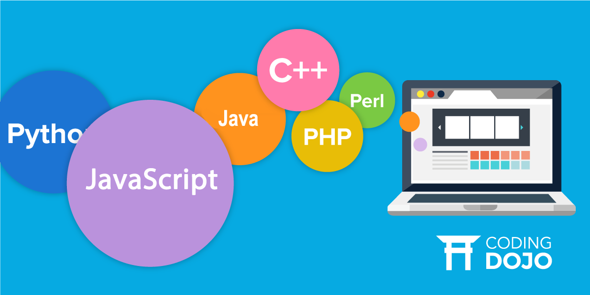

## How is JavaScript different from other languages?

When I worked as a web designer several years ago, I had used JavaScript for creating galley pages or animations. At that time, I didn't have any knowledge in programing except HTML/CSS. But I was easily able to download open source code and implement into HTML pages. Unlike C++ and Java, JavaScript is a scripting language. It doesn’t have to be compiled to be executed. Anyone can easily modify and update JavaScript codes because it can be opened in most programs (even in text editors). 

I learned Java and C/C++ in the previous ICS classes. JavaScript looks similar with these two languages. But the structure is much shorter and simpler than other languages. Also, JavaScript is flexible.  Programmers can use commands and variables in a flexible way. According to codingdojo.com, JavaScript is used by over 80% of developers and by 95% of all websites for any dynamic logic on their pages. JavaScript makes websites more dynamic and interactive. I have always wanted to learn JavaScript and apply my ideas to websites. I am so excited that I can finally learn JavaScript in ICS 314. 

## Athletic Software Engineering?

So far, athletic software engineering pedagogy is both stressful and enjoyable for me. It is stressful because I must get answers in limited time and each WOD is graded. However, WODs definitely make me to practice coding more than previous classes.

