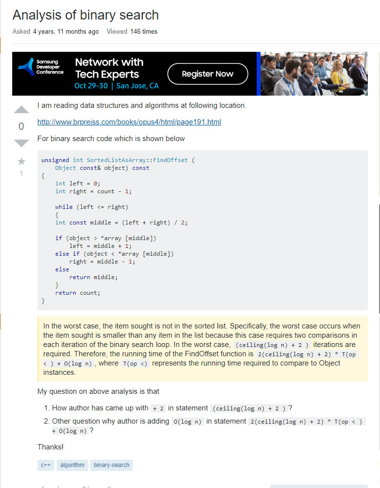

## Is there no such thing as a silly question?
The development of Information Technology has changed the ways of learning.  In the past, we had to go to library or meet people to get information. It took much time and efforts. Online communities provide free access to anyone who wants to learn. You can ask and answer questions easily. I often visit Hackers or Stack Overflow when I have questions about computer programming and sometimes feel overwhelmed by many unclear and similar questions.

After reading "How to Ask Questions the Smart Way" by Eric Raymond, I have realized that there are silly questions in the world. We need to ask questions in in a way more likely to get a satisfactory answer. I picked two "Smart" and "Not Smart" questions followed by the Raymond's principles.

## Smart Question

1. The question is related to the form. (Stack Overflow is for questions about programming.)
2. The subject header is meaningful and specific. 
3. The question includes an open-ended question. Open-ended questions tend to be perceived as open-ended time sinks. 
4. Describe the goal, not the step. 
5. The content is clear and detail.

## Not Smart Question

1. Volume is not precision - The questioner uses a website link and huge volumes of code. 
2. The subject header is not specific. It doesn't reflect the question in detail. 
3. The question doesn't describe the goal. It just requires answers.

 
## Too Much Information?
Today, we can get information we need quickly with flexibility. The development of Information Technology makes our lives easier, faster and better. People can not only access but also create information easily.  Vast amount of new information is created every second. Sometimes, we feel tired because of "Information Overload" or "Unnecessary Information". There is so much useless information on the internet. We need to learn how to control, sort, and manage information. 

