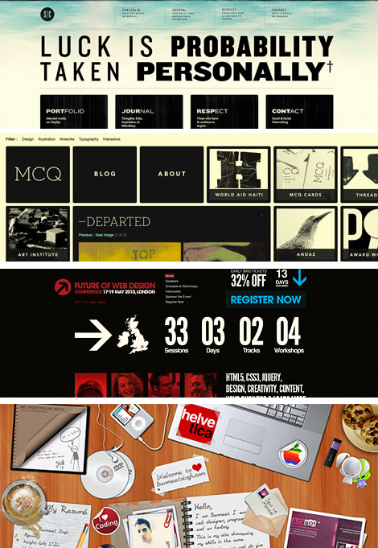

## My first CSS/UI framework "Bootstrap"
When I worked as an web designer 7 years ago, my company didn't use CSS/UI frameworks. Web designers had to write same CSS codes repeatly and test a website in difference browsers/platforms. I've started working at ITS from this summer. My boss asked me to learn Bootstrap for the website projects. After I learned Bootstrap, I was amazed by how easy bootstrap can make things and save hours of work.
			
I think the best tool of BootStrap is a built-in responsive grid system. The bootstrap grid divides the screen into 12 columns. You can adjust the layout easily according to the size of the device. Bootstrap also provides standard componants such as nav bars, drop downs, buttons, forms and etc. You can quickly style the elements by downloading the source code. Bootstrap is compitible with main browsers. You don't need to worry about cross-browser problems.

## CSS/UI frameworks limit the creativity of web designers
The websites above were created in the early 2010s. 
The websites created by CSS/UI frameworks look clean, simple and also very similar. The full-sized background image, same font sizes, same top menu bars, same grids.  You can still customize the css, but still 
Innovative designs are difficult to implement into the Bootstrap frame because it is using 12 columns.
			
CSS/UI framework are fast and easy to use. However, they limit the creativity of web designers. 
