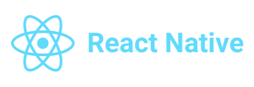
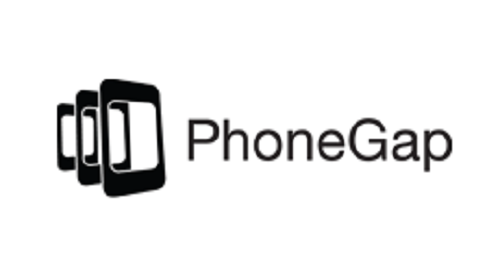

What is Native App Frameworks? Mobile app development is building native apps for iOS and Android devices. It requires different skills and technologies than website development. Native App Frameworks reduce time and energy in developing apps by providing a fundamental structure of mobile apps.
There are so many platforms and frameworks available. You should consider your team's skillsets, type of UI, costs, and many other things.  

## React Native
React Native was first introduced by Facebook in 2013. This framework has been a popular choice for many mobile developers. Code reusability is one of the benefits of using React Native. It is a cross-platform framework that can run both iOS and Android applications. Well-known companies such as Walmart, Airbnb, Wix, Instagram, and Facebook, use React Native. 

## Flutter
Flutter a free open-source software development kit launched by Google in 2017. You need to learn Dart to a programming language “Dart” to develop an app using Flutter. Dart is a typed object programming language and easy to understand for JavaScript or Java Developers. Because Dart code is compiled to native machine code, Flutter performs faster than other Native App Frameworks. 

## Adobe PhoneGap
PhoeGap is also called Apache Cordova. The Cordova development community is one of the largest communities, and you can get useful tips and support. You need CSS, HTML, and JavaScript to build a mobile app with PhoneGap.  The advantage of PhoeGap is that it has many built-in features like GPS, Storage, Camera, Phonebook, and more.

## My Choice is …
PhoneGap is one of the pioneers of mobile app development. I had always wanted to learn PhoneGap because it is compatible with other Adobe products such as Dreamweaver, Photoshop, and Illustrator.  I think PhoneGap is an excellent tool for web designers but not for web developers. React Native and Flutter, both of them are the most popular mobile development frameworks today. Flutter is new compared to React Native but fast-growing. In my opinion, Flutter could be a better choice for developing CSExplore because it performs faster and provides a custom app design function.  
