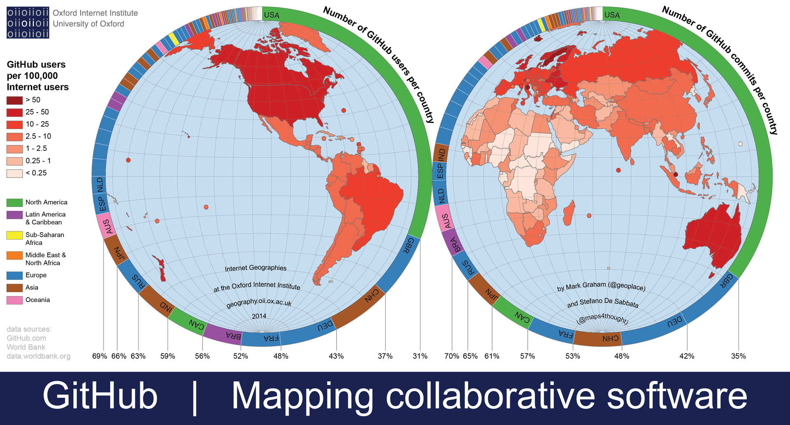

## Why Should Software Engineers Use GitHub?

The tool I used most in the ICS 314 class was GitHub. What is GitHub? GitHub is a cloud-based service that helps people share and manage their code, also track changes to their code. GitHub is especially popular for open-source projects because anybody can access projects for free to use or study. Open source project is useful for students because it allows them to learn and improve their projects. I was able to access various web developer tools and learning resources through GitHub. Also, GitHub was very helpful for the final group project because it allows to collaborate with my team member easily. 

As of May 2019, GitHub reports that there are over 37 million users and more than 100 million repositories. In many cases, companies ask you for a GitHub profile to view your projects.  As a CS student, it's important to maintain your GitHub page professional and update with new projects regularly.

## The Importance of Effective Communication

There are so many things involved in creating a website: hosting, template design, front-end development, back-end development, content writing, database, testing and etc. It’s important to communicate effectively among team members. For my final group project, we used a style of Agile Project Management called Issue Driven Project Management(IDPM). Agile Project Management is an iterative approach to manage projects. It breaks  a large project into small tasks, so enables a team to adapt to changes quickly. There are many benefits using IDPM. IDPM shows actual progress of a project. All of the team members can track the status of projects and be directly involved with management. 

For my final group project, we used a style of Agile Project Management called Issue Driven Project Management(IDPM). Agile Project Management is an iterative approach to manage projects. It breaks  a large project into small tasks, so enables a team to adapt to changes quickly. There are many benefits using IDPM. IDPM shows actual progress of a project. All of the team members can track the status of projects and be directly involved with management.

