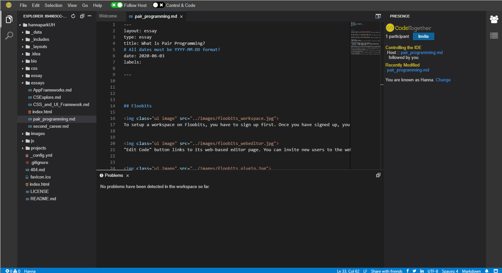

[Image by CodeTogether.com]

The animation above explains why we need a pair programming tool as a developer. It is always hard to explain code syntax in words. Pair programming allows users to observe each line of code and switch roles anytime. 
I had a chance to try two pair programming tools, [Floobits]( https://floobits.com/)and [CodeTogether]( https://www.codetogether.com/), with my team members.

## Floobits

To set up a workspace on Floobits, you need to sign up first. Once you have signed up, you can go to your dashboard and create a workspace. If you are on paid plans, you can have a private workspace that is not open to the public. There are two options to create a workspace. The first option is uploading a file folder manually to your workspace. The second option is importing a project from GitHub and linking it to your workspace.

Click "Edit Code," and it will link you to its web-based editor page. You can invite new users to the web-based editor page. Participants can access the editor page without registration or installation. Profiles appear in the right-side panel. Under the "Collaborate" menu, you can choose more options regarding collaboration. There are four types of workspace permission. (none, readable, writable, administrate) The owner of the workspace can set its permission for participants. 

You can also share files and invite new users through the Floobits plugin. Floobits offer plugins for IntelliJ IDEA, Atom, Emacs, Sublime Text, and Neovim. The plugin lets you create workspaces and upload code directly from your native editor. It is easy to install the plugin on IntelliJ. You just need to go to the settings and select "Plugins." Then, search for "Floobits plugin" using the search box. After the installation, you can view a Floobits button on the toolbar. You need a Floobits account to use the plugin.

## Code Together

The main principle of Code Together is similar to Floobits. It allows you to collaborate with others by sharing a link. CodeTogether is available for Eclipse, VS Code, and IntelliJ. Signup is not required to install CodeTogether plugin. You just need to download the plugin from their website and add it to your code editor. To share files, click “Start Sharing” link and send the URL to guests. CodeTogether is offering its premium plan ($8 per month) for free during the COVID-19 pandemic. 

## My User Experience
I had three group programming sessions with my team members. We used Floobits for the first and third sessions and CodeTogether for the second session. While using pair programming tools, we also held a Zoom meeting to communicate.
Floobits allowed multiple users to edit files simultaneously. Floobits sets different cursor colors for each user. On the other hand, CodeTogether allows only one person to edit files. You have to turn on the “Control & Code” button to take control and code. 
Both Floobits and CodeTogether are great tools to collaborate with programming with others.  However, I prefer using CodeTogether because of the following factors:

### 1. Easy to install (sign-up is not required)
After installing Floobits plugin, you have to sign-up for Floobits account to use the plugin. CodeTogether doesn’t require sign-up to install their plugin. You can share files in one click. 

### 2. Private and secure to share files
When you start a CodeTogether session, a unique key is generated and embedded into your invite URL. According to the [CodeTogher website] (https://www.codetogether.com/download/security/), the unique key is not saved in their server. It is only accessible by the host and guests.

### 3. “Control & Code” button
This button allows only one person to edit a file at a time. It avoids chaos and makes programming collaboration effective.

