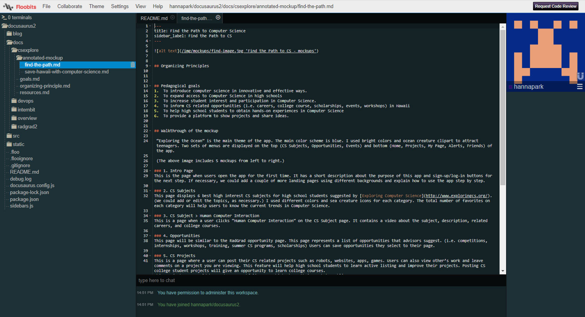
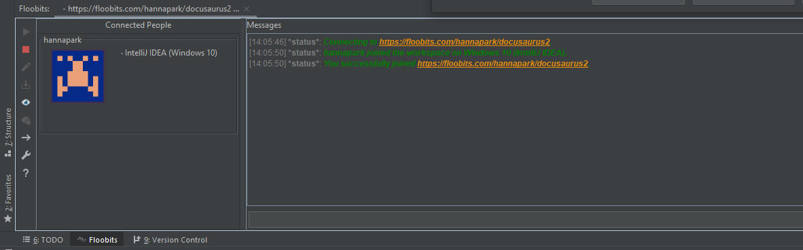

## Floobits

To setup a workspace on Floobits, you have to sign up first. Once you have signed up, you can go to your dashboard and create a workspace. If you are on paid plans, you can have a private workspace which is not open to the public. There are two options to create a workspace. The first option is uploading a file folder manually to your workspace. The second option is importing a project from GitHub and link to your workspace.

"Edit Code" button links to its web-based editor page. You can invite new users to the web-based editor page. Participants can access to the editor page without registration or installation. Profiles appear in the right-side panel. Under the "Collaborate" menu, you can choose more options regarding collaboration. There are 4 types of workspace permission. (none, readable, writable, administrate) The owner of workspace can set its permission for guests. 

Floobits also offers plugins for IntelliJ IDEA, Atom, Emacs, Sublime Text and Neovim. Floobits plugin lets you create workspaces and upload code directly from your native editor. It is easy to install plugin on IntelliJ. Go to the settings and select “Plugins”. Then, search for “Floobits plugin” using the search box. Once the Floobits plugin is installed, you can view a Floobits button on the toolbar. The green arrow. Like the Floobits workspace features, you can share files and invite new users through the Floobits plugin. 

### Code Together
***images/codetogether_plugin
The main principal of Code Together is similar with Floobits. It allows you to collaborate with others by sharing a link. CodeTogether is available for Eclipse, VS Code and IntelliJ. Signup is not required to install CodeTogether plugin. You just need to download the plugin from their website and add it to your code editor. To share files, click “Start Sharing” link and send the URL to guests. CodeTogether is offering their premium plan ($8 per month) for free during the COVID-19 pandemic. 

### My User Experience
I had three group programming sessions with my team members. 
1.	Session One -  5/30/2020, 1:30PM with Angeli Amascual, Max Deyo and Quinne Uchida
2.	Session Two -  6/1/2020, 3:00PM with Angeli Amascual, Max Deyo and Quinne Uchida
3.	Session Three -  6/2/2020, 2:00PM with Max. 

We used Floobits for the first and third session, and code together for the second session. While using pair programming tools, we also held a zoom meeting to communicate and share web editor links.
Floobits allowed multiple users to edit files simultaneously. As users make edits, Floobits sets different colors to each user. On the other hand, CodeTogether allows only one person to edit files. You have to turn on “Control & Code” button to take control and code. 

Both Floobits and CodeTogether are great tools to collaborate programming with others.  However, I prefer using CodeTogether because of the following factors:

1.	Easy to install (sign-up is not required)
After installing Floobits plugin, you have to signup for Floobits account to use the plugin. CodeTogether doesn’t require signup to install their plugin and you can share files in one click. 

2.	Private and secure to share files
When you start a CodeTogether session, a unique key is generated for the session and embedded into your invite URL. According the CodeTogher website (https://www.codetogether.com/download/security/), the unique key is not saved in their server. It is only accessible by the host and guests.

3.	“Control & Code” button
This allows only one person to edit a file at a time. It makes you to see where your participant is and easily detect changes. To avoid chaos and make programming collaboration effective, it’s better to assign one editor at a time.

